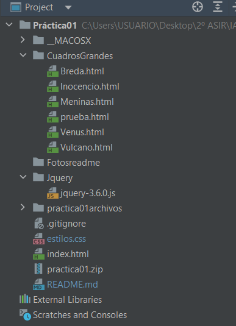
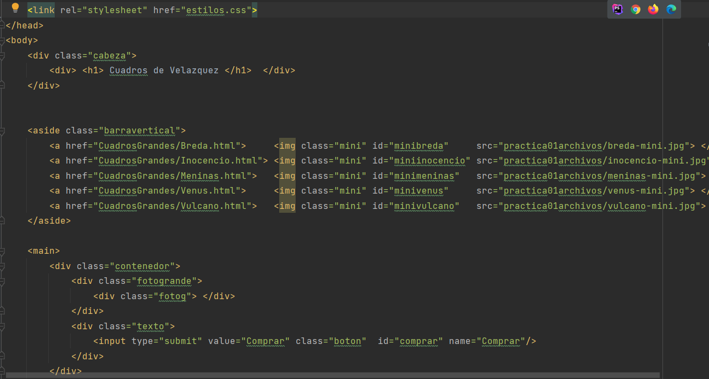
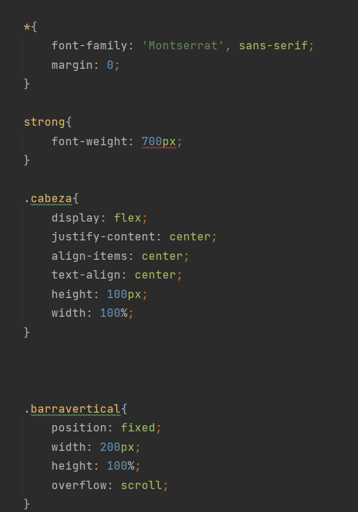
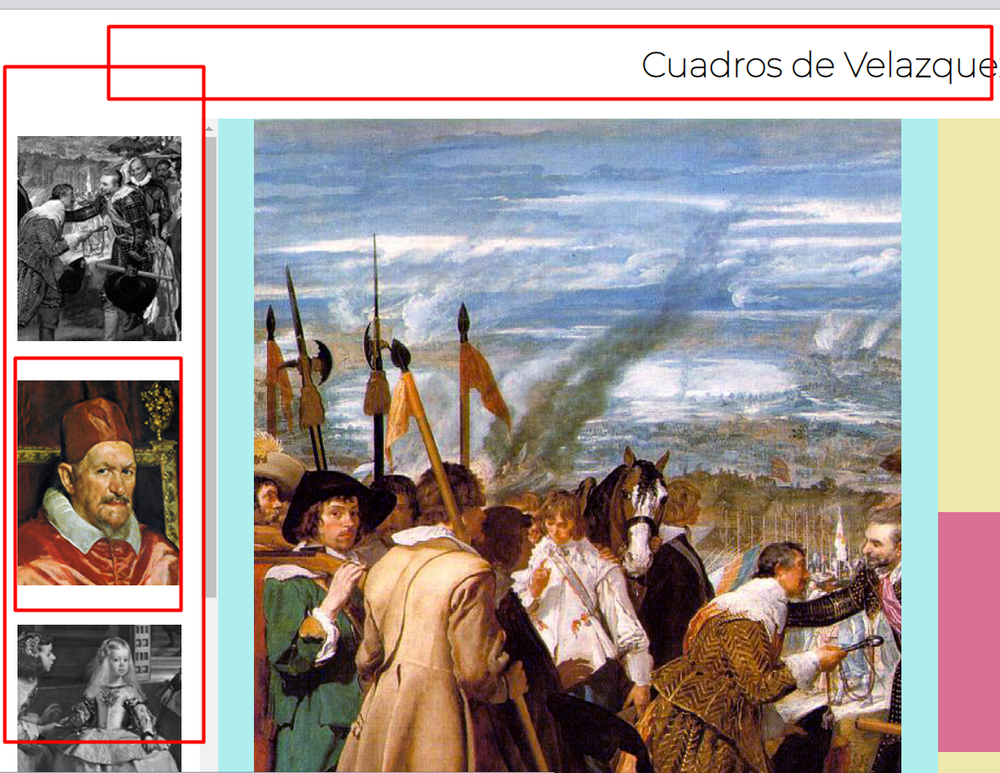
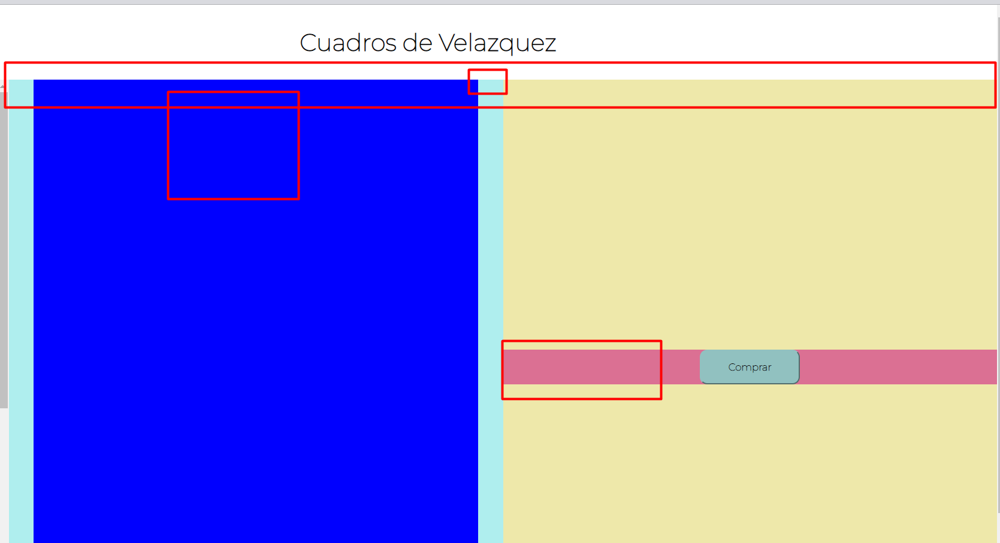
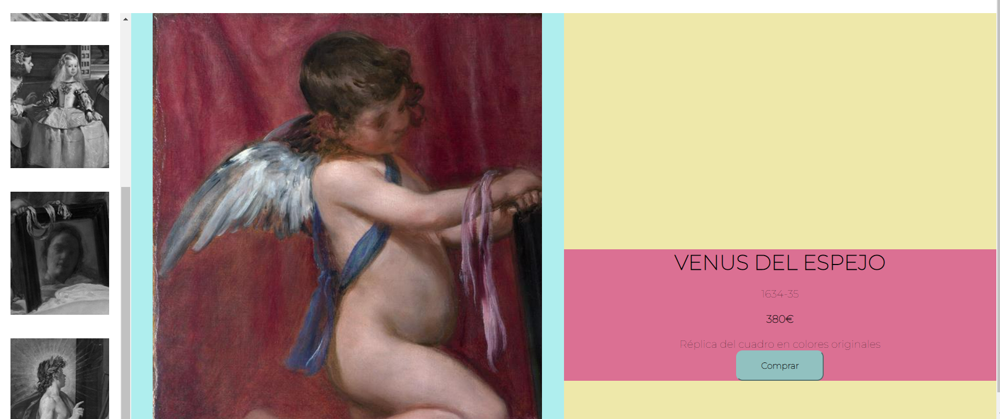
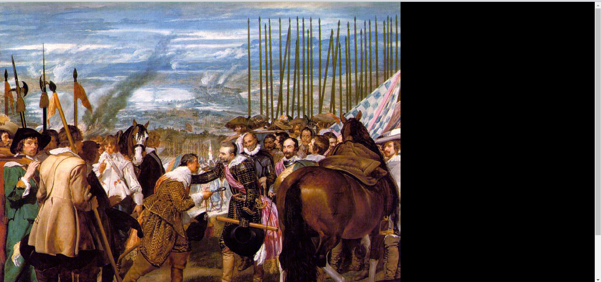
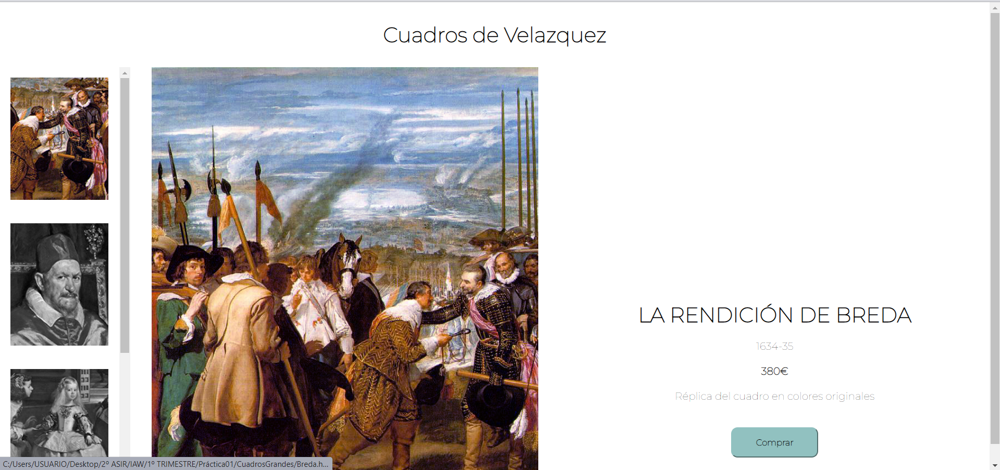

## PRÁCTICA 01 GitHub

# Creación de los archivos
He empezado creando los archivos que voy a necesitar para poder llevar 
adelante la práctica. Los archivos son, el "index.html", su respectivo "estilos.css".

Despues de hacerlo hge hecho un commit.
(Primero hice el index.html, y desp)

# Código 
Lo siguiente que hice, fue hacer el código y el css del index.html. Este cuenta con todas
las especificaciones que he podido hacer de la práctica.

### Encabezado y Sidebar
Lo primero fue el Header o encabezado de la página y la sidebar o barra lateral.
Después de eso hice un commit, para guardar todo lo que había hecho.
El sidebar tiene un overflow: scroll  que nos permite ver las demás miniaturas sin 
que tengamos que bajar toda la página, y un hover que hace que la miniatura cambie 
de blanco y negro a color.

### Espacio restante
Luego dividí el espacio restante (amarillo) a la mitad, el espacio del cuadro grande (azul claro) y el 
espacio del texto(rosa) y el botón de compra (rosa).

### Páginas extra
Lo siguiente que hice fue crear el resto de páginas que voy a necesitar e ir 
escribiendo su código específico como el texto y la imágen.

### JQuery
Intenté hacer lo anterior con Jquery, para no tener que hacer demasiadas páginas, pero
no me salió, así que no lo he usado.

        $(document).ready (function(){
            $("#minibreda").click(function (){
                /* alert("checked"); */
                $("").appendTo(".fotog");
                $("<h1> <strong> LA RENDICIÓN DE BREDA </strong></h1> " +
                    "
 <strong> 380€ </strong>
  \n" +
                    "
  réplica del cuadrado en colores originales y tamaño 150x80cm
").appendTo(".texto");
            });

            $("#miniinocencio").click(function (){
                $("").appendTo(".fotog");
                $("<h1> <strong> LA RENDICIÓN DE BREDA </strong></h1> " +
                    "
 <strong> 380€ </strong>
  \n" +
                    "
  réplica del cuadrado en colores originales y tamaño 150x80cm
").appendTo(".texto");
            });
        });
    
### Jquery, pantalla grande
Para mostrar el cuadro en grande, con el fondo negro he usado jquery, pero no me ha salido del todo bien.
Me falta ajustar el tamaño de la imágen.

### Ultimar detalles
Centrar las imágenes y terminar lo de que la foto salga en grande con el fondo en negro.
El index.html y Breda.html son iguales, pero me he dado cuenta al final.
También he quitado los fondos de colores que me han ayudado a organizarme.

